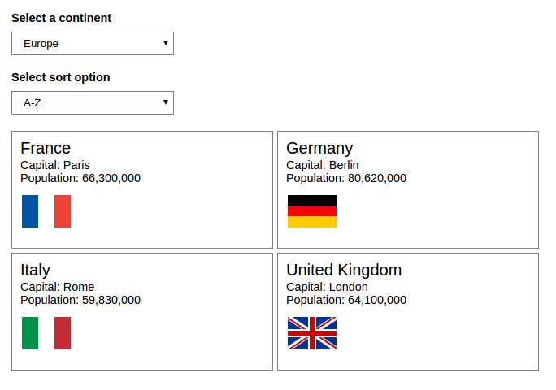

# RXJS Examples

This repo contains a series of examples using RXJS.

## Example 01 - Simple debt calculator
We create a stream for each of the three inputs and use `combineLatest` to get the most recent values for the calculation.
The default values are taken from `startWith` which is fed in from the element when it's rendered.

  

## Example 02 - Basic autocomplete
The autocomplete runs each time a character is entered into the input element. We use the `filter` operator to discard empty strings.

  

## Example 03 - Sorting and filtering
Results are sorted and filtered upon selection of a value from each select element.
We actually apply the sort to the object before converting it to a stream to limit the number of items in the observable.

  

